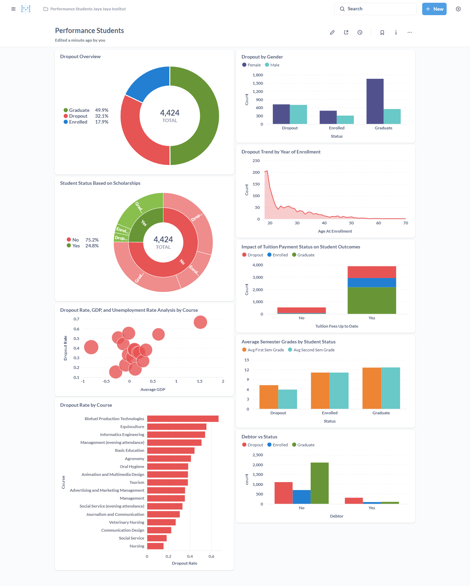

# Proyek Akhir: Menyelesaikan Permasalahan Perusahaan Edutech
## Business Understanding

Jaya Jaya Institut adalah institusi pendidikan tinggi yang telah berdiri sejak tahun 2000 dan memiliki reputasi yang baik dalam mencetak lulusan berkualitas. Namun, institusi ini menghadapi tantangan besar dengan tingginya angka siswa yang tidak menyelesaikan pendidikan mereka atau dropout.

Untuk mengatasi masalah ini, Jaya Jaya Institut berupaya mendeteksi siswa yang berpotensi dropout sejak dini agar dapat diberikan bimbingan khusus. Sebagai calon data scientist, Anda diminta untuk membantu institusi ini dalam menganalisis data dan memberikan solusi untuk mengurangi angka dropout tersebut.

### Permasalahan Bisnis

1. Tingginya angka siswa yang tidak menyelesaikan pendidikan atau dropout.
2. Kurangnya sistem deteksi dini untuk mengidentifikasi siswa yang berpotensi dropout.
3. Minimnya data analisis yang dapat digunakan untuk memberikan bimbingan khusus kepada siswa yang membutuhkan.
4. Dampak negatif terhadap reputasi institusi akibat tingginya angka dropout.
5. Kebutuhan untuk meningkatkan efisiensi dan efektivitas dalam memberikan solusi berbasis data untuk mengurangi angka dropout.

### Cakupan Proyek

Proyek ini akan mencakup langkah-langkah berikut:

1. **Eksplorasi Data**: Mengumpulkan dan menganalisis data siswa untuk memahami pola dan faktor-faktor yang berkontribusi terhadap dropout.
2. **Pra-pemrosesan Data**: Membersihkan dan mempersiapkan data agar siap digunakan untuk analisis lebih lanjut.
3. **Pengembangan Model Machine Learning**: Membuat model prediktif untuk mendeteksi siswa yang berpotensi dropout berdasarkan data historis.
4. **Evaluasi Model**: Mengukur kinerja model menggunakan metrik evaluasi yang relevan untuk memastikan akurasi dan keandalannya.
5. **Pembuatan Dashboard**: Mengembangkan dashboard interaktif untuk memvisualisasikan hasil analisis dan memberikan wawasan kepada pemangku kepentingan.
6. **Rekomendasi Solusi**: Memberikan rekomendasi berbasis data untuk membantu institusi mengurangi angka dropout.
7. **Dokumentasi dan Presentasi**: Menyusun laporan akhir dan mempresentasikan hasil proyek.

### Persiapan

#### Sumber Data
Proyek ini menggunakan dataset yang tersedia di repositori berikut: [Dataset](https://github.com/dicodingacademy/dicoding_dataset/tree/main/students_performance). Dataset ini berisi informasi terkait performa siswa, termasuk data demografis, akademik, dan faktor-faktor lain yang relevan untuk analisis. Dataset ini mencakup kolom-kolom berikut:

- **Marital_status**: Status pernikahan siswa.
- **Application_mode**: Mode aplikasi yang digunakan saat mendaftar.
- **Application_order**: Urutan aplikasi yang diajukan.
- **Course**: Program studi yang diambil siswa.
- **Daytime_evening_attendance**: Kehadiran siswa (siang/malam).
- **Previous_qualification**: Kualifikasi pendidikan sebelumnya.
- **Previous_qualification_grade**: Nilai dari kualifikasi pendidikan sebelumnya.
- **Nacionality**: Kewarganegaraan siswa.
- **Mothers_qualification**: Kualifikasi pendidikan ibu.
- **Fathers_qualification**: Kualifikasi pendidikan ayah.
- **Mothers_occupation**: Pekerjaan ibu.
- **Fathers_occupation**: Pekerjaan ayah.
- **Admission_grade**: Nilai masuk siswa.
- **Displaced**: Status apakah siswa pindah tempat tinggal.
- **Educational_special_needs**: Kebutuhan pendidikan khusus.
- **Debtor**: Status apakah siswa memiliki utang.
- **Tuition_fees_up_to_date**: Status pembayaran biaya kuliah.
- **Gender**: Jenis kelamin siswa.
- **Scholarship_holder**: Status penerima beasiswa.
- **Age_at_enrollment**: Usia saat pendaftaran.
- **International**: Status siswa internasional.
- **Curricular_units_1st_sem_credited**: Jumlah mata kuliah semester pertama yang diakui.
- **Curricular_units_1st_sem_enrolled**: Jumlah mata kuliah semester pertama yang diambil.
- **Curricular_units_1st_sem_evaluations**: Jumlah evaluasi mata kuliah semester pertama.
- **Curricular_units_1st_sem_approved**: Jumlah mata kuliah semester pertama yang disetujui.
- **Curricular_units_1st_sem_grade**: Nilai rata-rata mata kuliah semester pertama.
- **Curricular_units_1st_sem_without_evaluations**: Jumlah mata kuliah semester pertama tanpa evaluasi.
- **Curricular_units_2nd_sem_credited**: Jumlah mata kuliah semester kedua yang diakui.
- **Curricular_units_2nd_sem_enrolled**: Jumlah mata kuliah semester kedua yang diambil.
- **Curricular_units_2nd_sem_evaluations**: Jumlah evaluasi mata kuliah semester kedua.
- **Curricular_units_2nd_sem_approved**: Jumlah mata kuliah semester kedua yang disetujui.
- **Curricular_units_2nd_sem_grade**: Nilai rata-rata mata kuliah semester kedua.
- **Curricular_units_2nd_sem_without_evaluations**: Jumlah mata kuliah semester kedua tanpa evaluasi.
- **Unemployment_rate**: Tingkat pengangguran.
- **Inflation_rate**: Tingkat inflasi.
- **GDP**: Produk Domestik Bruto.
- **Status**: Status akhir siswa (misalnya, lulus, dropout, dll.).

Kolom-kolom ini memberikan wawasan yang kaya untuk analisis dan pengembangan model prediktif.

#### Setup Environment

1. **Menginstal Dependensi**  
    Instal semua dependensi yang diperlukan menggunakan file `requirements.txt` dengan perintah berikut:
    ```bash
    pip install -r requirements.txt
    ```

2. **Mengunduh Dataset**  
    Unduh dataset dari link yang telah disediakan dan simpan di direktori proyek Anda.

3. **Menjalankan Jupyter Notebook**  
    Gunakan Jupyter Notebook untuk eksplorasi data dan pengembangan model machine learning.

## Business Dashboard

### Penjelasan Dashboard
Dashboard yang telah dibuat menggunakan Metabase bertujuan untuk memberikan wawasan interaktif kepada pemangku kepentingan terkait analisis data siswa. Dashboard ini mencakup visualisasi data seperti tingkat dropout, distribusi nilai, dan faktor-faktor yang memengaruhi performa siswa. Dengan menggunakan dashboard ini, pengguna dapat dengan mudah mengidentifikasi pola dan tren yang relevan untuk pengambilan keputusan.

### Cara Mengakses Dashboard
Dashboard dapat diakses melalui platform Metabase dengan langkah-langkah berikut:

1. Buka browser Anda dan akses URL berikut: [Metabase Dashboard](http://localhost:3000).
2. Masukkan kredensial berikut untuk login:
    - **Email**: `root@mail.com`
    - **Password**: `root123`
3. Setelah login, Anda akan diarahkan ke halaman utama dashboard. Pilih dashboard yang sesuai untuk melihat visualisasi data.

### Contoh Tampilan Dashboard
Berikut adalah contoh tampilan dari dashboard yang telah dibuat:



Dashboard ini dirancang untuk mempermudah eksplorasi data dan memberikan wawasan yang dapat ditindaklanjuti untuk mengurangi angka dropout siswa.

## Menjalankan Sistem Machine Learning
Untuk menjalankan prototype sistem machine learning yang telah dibuat, ikuti langkah-langkah berikut:

1. **Pastikan semua dependensi telah diinstal**  
    Gunakan file `requirements.txt` untuk menginstal semua dependensi yang diperlukan:
    ```bash
    pip install -r requirements.txt
    ```

2. **Jalankan aplikasi Streamlit**  
    Prototype sistem machine learning ini menggunakan Streamlit sebagai antarmuka pengguna. Jalankan aplikasi dengan perintah berikut:
    ```bash
    streamlit run app.py
    ```

3. **Akses aplikasi melalui browser**  
    Setelah perintah di atas dijalankan, aplikasi akan berjalan di server lokal. Anda dapat mengaksesnya melalui browser di alamat berikut:  
    [http://localhost:8501](http://localhost:8501)  
    Selain itu, aplikasi yang telah di-deploy dapat diakses melalui link berikut:  
    [https://students-performance-dicoding.streamlit.app/](https://students-performance-dicoding.streamlit.app/)

4. **Gunakan antarmuka aplikasi**  
    - Isi formulir yang tersedia dengan data mahasiswa, seperti status pernikahan, program studi, nilai masuk, dan informasi lainnya.
    - Klik tombol **"🔍 Prediksi"** untuk mendapatkan hasil prediksi.

5. **Interpretasi hasil prediksi**  
    - Jika hasil menunjukkan **"BERISIKO DROPOUT"**, aplikasi akan memberikan probabilitas risiko dropout dan visualisasi indikator risiko.
    - Jika hasil menunjukkan **"TIDAK BERISIKO"**, aplikasi akan memberikan probabilitas bertahan dan visualisasi indikator risiko.

Prototype ini dirancang untuk membantu institusi pendidikan dalam mendeteksi siswa yang berpotensi dropout dan memberikan rekomendasi tindakan yang sesuai.

## Conclusion

Berdasarkan analisis dashboard "Performance Students" Jaya Jaya Institut, tingginya angka dropout disebabkan oleh beberapa faktor utama, yaitu ketidakmampuan membayar uang kuliah tepat waktu, rendahnya prestasi akademik pada semester awal, kurangnya dukungan beasiswa, serta tingginya tingkat dropout pada program studi tertentu seperti Biofuel Production Technologies dan Informatics Engineering. Selain itu, mahasiswa yang masuk di usia muda, berjenis kelamin laki-laki, dan memiliki status debitur juga cenderung memiliki risiko dropout lebih tinggi. Dengan memanfaatkan dashboard interaktif ini dan menerapkan analisis data serta model prediktif machine learning, institusi dapat mengidentifikasi siswa berisiko sejak dini dan memberikan intervensi yang tepat, sehingga diharapkan mampu menurunkan angka dropout secara signifikan dan meningkatkan reputasi institusi dalam jangka panjang.

### Rekomendasi Action Items
Berikut beberapa rekomendasi action items yang dapat dilakukan oleh Jaya Jaya Institut untuk mengatasi permasalahan dropout dan mencapai target peningkatan retensi mahasiswa:
- Mengembangkan sistem deteksi dini berbasis machine learning untuk mengidentifikasi mahasiswa yang berisiko tinggi mengalami dropout berdasarkan data akademik, keuangan, dan demografis.

- Memberikan dukungan finansial yang lebih luas melalui perluasan program beasiswa dan keringanan pembayaran, terutama bagi mahasiswa dari latar belakang ekonomi menengah ke bawah atau yang belum melunasi biaya kuliah secara rutin.

- Meningkatkan kualitas pembelajaran dan pendampingan akademik pada semester awal, termasuk program mentoring dan tutoring bagi mahasiswa baru, guna membantu mereka beradaptasi dan mencapai prestasi yang lebih baik.

- Melakukan evaluasi dan perbaikan kurikulum serta metode pengajaran di program studi dengan tingkat dropout tinggi, serta menyediakan jalur alternatif atau fleksibel seperti kelas malam yang lebih terstruktur.

- Meluncurkan program konseling dan pengembangan karakter untuk mendukung mahasiswa secara psikologis dan sosial, khususnya bagi mahasiswa muda yang baru masuk dan rentan mengalami tekanan akademik maupun pribadi.